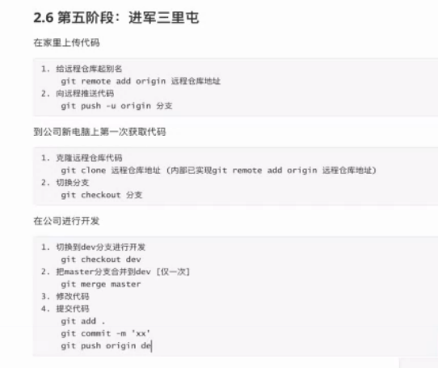
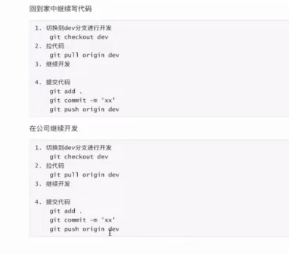

# GitHub

## 一、什么是Git？

git是分布式版本控制软件

#### 版本控制

这个是什么呢？其实我们或多或少会接触版本控制，比方说，你第一次写东西，交给你的导师，你的导师说提交的论文不对，方向有错，要让你改，所以你会有：

- 毕业设计
- 毕业设计第二版
- 毕业设计第三版....

你怎么做的？

1. 文件的复制和粘贴

2. 本地版本控制软件：你只会看到一个文件，但文件的背后，他帮你用其他方式保存了

3. 集中式版本控制：但随着时间的推移，只用本地的版本控制，是满足不了要求的，比方说要一个小组一起做某个项目，就不能协同完成了。这个时候，就出现了集中式的版本控制，将所有东西都保存到中心服务器中，有verison1.2.3.... 其中较为有名的就是SVN了。但这种方式有一个问题是，假如断网了，就不能上传了。

4. 分布式版本控制：分布式就是在云端有，在各自的电脑中也有V1，V2,V3，就算其中一个有问题，也不影响我们代码或文件的完整性。当A提交新的版本时，新的版本会先提交到本地电脑的仓库中，然后再会推到云端。

   

   **现在很多非程序员还是在用文件的复制和粘贴方式去做版本控制**

   

## 二、 为什么要做版本控制？

设计多套方案，然后有后备方案

假如某个功能出现问题，一行代码就能回滚到前一个版本，方便各个功能的控制。


## 安装 Git


云端——电脑A——电脑B

要安装在哪里？安装在自己的电脑。但安装完后只能在各自的电脑上储存。要上传到云端，就需要联网上传到GitHub或GitLib。


操作系统：Linux、Mac和Windows

Linux和Mac能通过终端安装，而windows只能通过软件包安装。


## 四、创业初期的故事

XXX的创业故事，然后讲解Git的操作。

第一阶段： 1 人 ，自己写代码

- 创建文件夹——所有文件都放在这个文件中
- 当项目写完后，怎样用Git做版本控制？——实质是管理文件夹
- 进入要管理的文件夹
- 初始化（提名）
- 管理里面的文件夹
- 目的是生成版本——Git add index.html，接着再git status，会发现 index.html会变绿了，没有被管理的是红色的。
- 要管理文件夹下的所有文件呢？git add .
- 生成一个版本：git commit -m '描述信息，这里可以随便填'
- 这个时候再git status一下，发现东西都没有了。
- 假如再在原来的地方修改新功能，git会怎样？git status一下。modify了。
- 这个时候还需要 git add . 让Git再管理
- 假如还要生成版本，就需要再次git commit -m 'v2'什么的
- 假如要查看日志，可以输入git log


**总结：**

1. git init 初始化，让Git帮助我们管理当前的文件夹
2. git status 检测当前目录下文件的状态
3. 三种状态的变化：
   - 红色： 新增的文件 或 修改了的旧文件
   - 绿色： Git已经管理了，然后用gi commit -m '描述信息'
   - 然后就可以生成一个版本了。


## 五、 第一次运行Git需要注意的地方


为什么你的电脑会报错？

在生成版本之前，需要告诉Git你的身份，才能通过验证。

这个时候需要个人信息配置：用户名、邮箱

```
git config --global user.email "you@example.com"
git config --global user.name "Your name"
```

这一行命令只需要在第一次运行的时候执行。


## 六、Git的三大区域

工作区、暂存区、版本库


### 工作区

工作区可以分为两部分，或者说是两种状态：

1. 已管部分
2. 新文件或已修改的旧文件或未管理的部分（红色区）


### 暂存区

绿色区域

当你Add 一个文件或全部文件的时候，是将文件提交到暂存区的，假如我们决定生成一个新版本，我们可以commit的命令，将暂存区的文件放到版本区。假如思考过后发现还需要修改，就需要回滚。


## 七、 回滚到上一个版本

**第一阶段：自己写代码**

mac 有一个终端叫iterm2，会比自带的终端好用很多。

1. git init 初始化
2. git add .
3. git commit -m "第一次配置"
4. git status


**第二阶段：增加短视频功能**

写完之后，git stutas一下

git add .

git commit -m "短视频上线"


**第三阶段：餐饮功能**

git add.

git commit - "餐饮功能上线啦"


终于有一天，发现有问题了，要下线餐饮功能，那你怎么做？

快速回滚到上一个版本的状态。

git log 查看记录

git reset --hard 这里应该有一串MD5的版本号。

git stutas


假如再回滚到餐饮功能的版本呢？

git log 一下，发现只有前两个记录，我们怎么回滚？

git reflog  ——用这个命令可以查到回滚的记录

然后再依次 git reset --hard 第三个版本号

git log一下，发现又出现了


## 八、Git命令小总结

``` Git
git init
git add
git commit
git log
git relog
git reset --hard 版本号 #回滚，往前滚，来回滚
git checkout -- index.html #由红色改为未变动
git reset HEAD index.html绿色回到红色

```


## 九、Git的分支

版本C1——100个文件

版本C2——修改了10个，新增了20个

这两个文件间是有差异的，这些是只增加了文档还是重新复制一份呢？？只保留修改的部分，其他的部分是类似快照。

版本和版本之前有一个指针的东西，没有改变的东西只需要通过指针指向旧的文件就行了。

随着时间的推移，又生产了一个版本，C3，C3本身有修改的部分，然后没有修改的部分又指向了C2


后来又有C4和C5基于C3上开发新的版本，这样就变成了一个分支了，假如要将C4和C5的功能合并起来，变成C6.


## 十、紧急修复线上bug的思路

我们的故事来到了第四阶段：商城

比方说，抖音最近下面有一个商品平台，假如我们也要开发一个这么一个商城呢？

好了，这个时候我们已经开发了一个多月，然后发现版本三有一个Bug，我们应该怎样处理？回滚？当然不行，我们已经开发了的怎么版？别担心，我们知道分支这个知识点的时候，就会发现这个是很好哦实现的。

c1——C2——C3——分支C4（新功能），分支C5（修复Bug），然后合并到master分支，变为C6，最后C4的功能开发完了，就再次合并到mater中。。

分支的主干线为master，他的分支可以自己其名字。分支，其实就是环境的隔离。


## 十一、 基于分支修复线上bug

git branch会返回master

git branch dev 会返回master dev

git baranch 回到branch

git checkout dev #切换到dev

	- git add.
	- git commit -'C4'
	- 

git checkout master 回到c3

git branch bug

git branch


git check bug

git status

git add .

git commit -m "c5" #修复完bug


master就是线上的运行主体，我们现在要将修复完bug的分支合并到master，这个时候要先切回到master

git checkout master

git merge bug #c5的代码合并到C3里了

git log

这个时候bug 分支就没用了，我们要删掉他

git branch -d  bug

新功能

git checkout dev#因为是从C3过来的，Bug还没有修复，现在

git add .

git commit -m "商城功能开发完毕C6"

让线上代码有C6的功能

切回到master .check out master

git merge dev #合并之后，他报了一个冲突

为什么会有这个冲突呢？因为我们修改了bug，而分支C4 是没有的，这就产生了冲突，他会将两个文件都放在一起，这就需要我们手动区解决，修复完了后

git stutas

git add.

git commit -m "解决bug和商城合并C7"

git log


为什么C5和C3合并没有冲突呢？因为是人为改，自动覆盖了，而有在同一行修改，就会有冲突了，需要自己去改

一定要有一个master分支，有新功能的话就需要建立一个分支，然后调试好了再合并。

## 十二、分支命令总结

查看分支

git branch

创建分支

git branch 分支名称 


切换分支

git checkout 分支名称


分支合并

git merge 要合并的分支

注意：一定要切换分支再合并

合并分支时可能会产生冲突，有一个软件可以解决这个问题。


删除分支

git branch -d 分支名称


命令很简单，重要的是开发流程。


Git的工作流：

​													

默认的分支——master C1（稳定版）————合并

​								Dev	|—开发版，公测版—/


## 十三、GitHub

家————云端（代码仓库）————公司

github和Git是没有关系的！ Github只是代码托管公司。


注册一个Github账号

然后在Github创建一个仓库，对应该项目

本地代码推送至仓库


## 十四、 基于Github做代码托管

Home--—upload to —-Cloud Sever

注意上传两次分支

cloud sever ——Company

git clone gitadress

注意，这里clone了以后，只显示一个分支，但实际上已经全部下载了，只需要

checkout 相应分支就行


第五阶段：进军三里屯

给远程仓库起别名

git remote add *(origin)  远程仓库地址


向远程推送代码

git push -u origin 分分支


下载代码

1。。克隆代码

git clone 远程仓库地址

2. Git checkout 分支名称

分支别称只输入一次就可以


## 十五


git push origin dev


Home: 

git pull origin dev

touch a2.py #创建了一个a2.py文件


到了公司，继续开发，再次更新：

git pull origin dev






开发完毕，要上线：

1. 将dev进行合并到master

   git checkout master

   git merge dev

   git push origin master

   

2. 把dev分支也推送到远程

   git checkout dev

   git merge master

   git push origin dev

3. 到家后，再将这些pull回来

